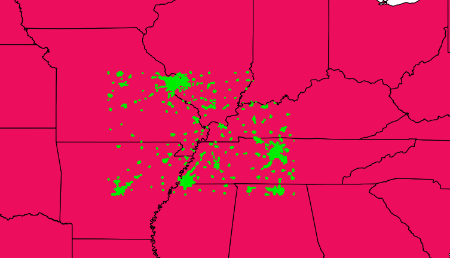
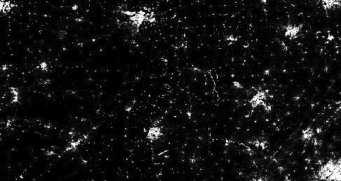
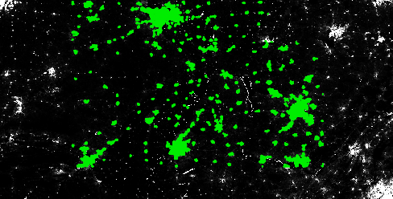
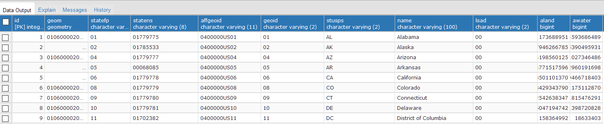
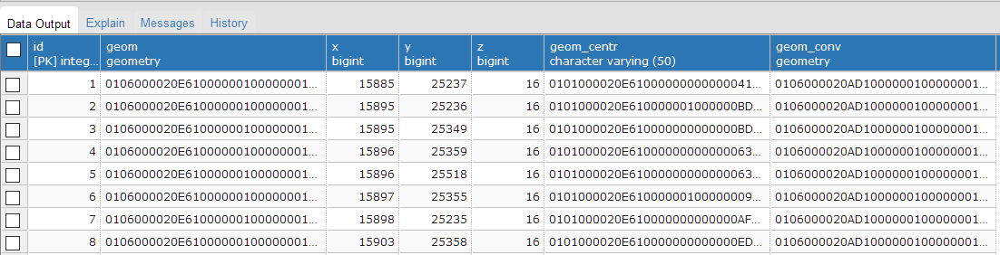
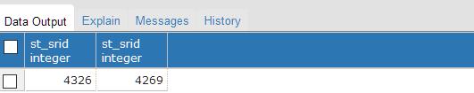
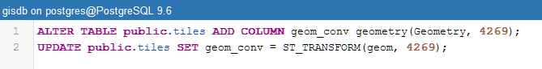
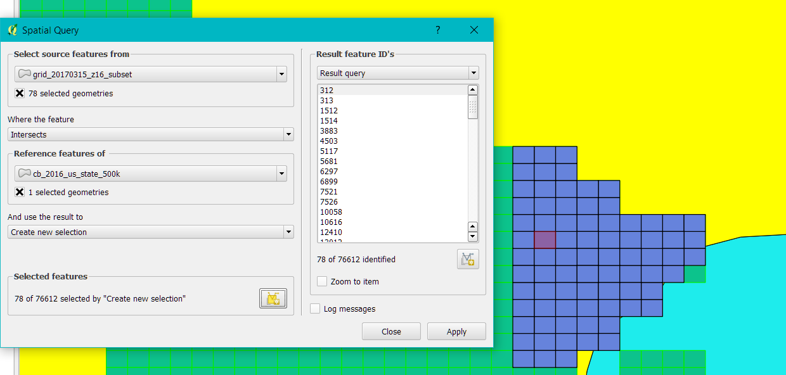
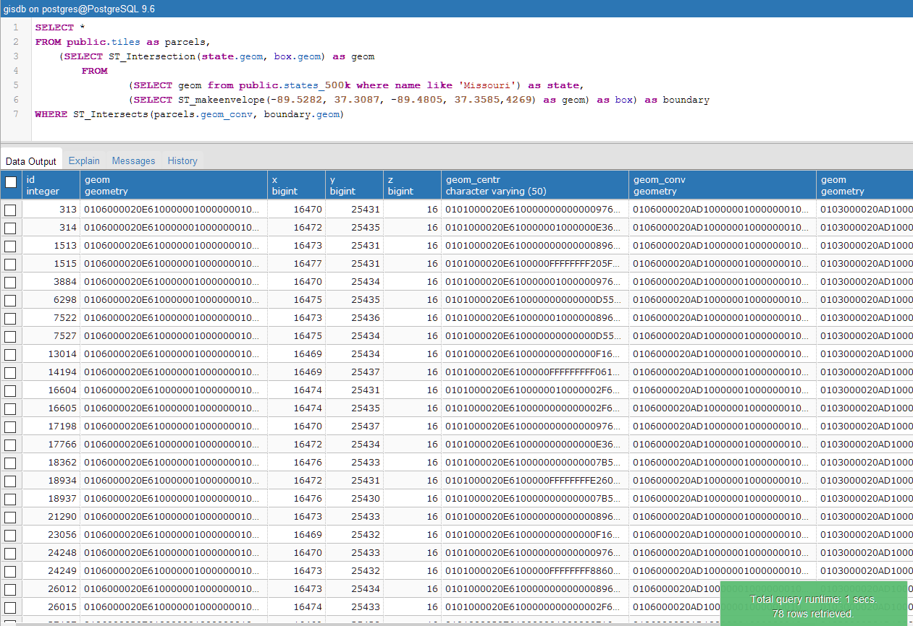

# Density-of-Parcels-in-Imagery-Data

## Outline

1. [Problem Overview](README.md#1-problem-overview)
2. [Setup](README.md#2-setup)
3. [Data Exploration and Ingestion](README.md#3-data-exploration-and-ingestion)
4. [Queries](README.md#4-queries)
5. [Python Script](README.md#5-python-script)
6. [Performance](README.md#6-performance)


## 1. Problem Overview

Given imagery data in the form of a multi-level raster tile map, at a resolution of 20 the geometries and centroids of all detected parcels are saved and stored as a seperate vector layer. The task is to write a pipeline to calculate the density of these parcels in two different contexts:

* With respect to a set of tiles at any desired zoom level between 16 and 20
* With respect to a human-readable map and associated boundaries of interest (e.g. political or metropolitan boundaries)


## 2. Setup

I used the following tools:

* Latest version of Postgres and PostGIS package.
* Latest version of QGIS.
* Python3


## 3. Data Exploration and Ingestion

There are 3 different suggested souces of data to use. The first is publicly available shapefiles of state geometries [[1]]. The second is publicly available census data to use as proxies [[2]]. The third is a tile map system containing parcel information provided by Cape Analytics.

First I imported the shapefiles of the state geometries and Cape Analytics tile map system into QGIS to visualize the distribution of parcels and make sure I was using the correct data. I used the 500k resolution files for the state geometries.



Next, I was unsure of what the public census data was to be used for and so I imported it as a raster layer in QGIS and compared it with the Cape Analytics data. From the images below, I inferred that the Cape Analytics data was simply a subset of this census data which was converted to a shapefile. Therefore, I did not include the public census data in my database, instead choosing to limit the scope of parcel density to the following states: TN, KY, VA, NC, GA, AL, MS, AR, MO, IL.

  

Since my data was already in QGIS, I used QGIS to import my data into Postgres [[3]]. So I had 2 tables in Postgres, one for the states geometries and one for the tile map system. In PostGIS, I ran a simple query to see what the columns and data looked like.

States Table:
```sql
SELECT * FROM public.states_500k
ORDER BY id ASC LIMIT 100
```


Tiles Table:
```sql
SELECT * FROM public.states_500k
ORDER BY id ASC LIMIT 100
```


I also wanted to take a closer look at the geometry columns for both tables, so I ran the query below. 


```sql
SELECT ST_SRID(tiles.geom), ST_SRID(states.geom)
FROM public.tiles as tiles, public.states_500k as states
LIMIT 1
```


What I found was that the spatial reference identifier for the two geometries was different. Since my initial intuition was that I would need to do a spatial join between these two geometries, I created a new geometry column in the tiles table with the tile geometry SRID converted.

```sql
ALTER TABLE public.tiles ADD COLUMN geom_conv geometry(Geometry, 4269);
UPDATE public.tiles SET geom_conv = ST_TRANSFORM(geom, 4269);
```


## 4. Queries

Before I started implementing queries, I had to think about how I was going to test my query. More specifically, how was I going to know what area of the map the user was looking at so that I could find the parcel density in that area. I decided to make the following assumption: if the user was looking at a map at a certain zoom level (we will call this the map view), the coordinates of the map view boundary would be passed to my pipeline. In addition, the user would specify what state they are currently interested in finding the parcel density for (this handles the case where there are multiple states in the map view).

So first I start with the query to generate a geometry from the user's map view. This was my initial approach:
```sql
SELECT ST_MakePolygon(ST_AddPoint(view.open_line, ST_StartPoint(view.open_line))) as user_geom
FROM ( 
  SELECT ST_GeomFromText('LINESTRING(-89.98 37.79, -89.8 37.79, -89.78 37.66, -89.96 37.66)', 4269) as open_line
  ) as view
```

However, I found that if my coordinates (which I was manually entering) weren't perfect or if I had selected a linestring which crossed over multiple states, I ran into issues. After more research, I found the ST_MakeEnvelope function, which created a bounding box from coordinates.
```sql
SELECT ST_makeenvelope(-89.5282, 37.3087, -89.4805, 37.3585,4269) as geom
```

Next I make a query to get the geometry of the state the user is interested in. Just as an example, I have assumed the user has chosen Missouri.
```sql
SELECT name, geom 
FROM public.states_500k 
WHERE name like 'Missouri'
```

Now that I have these 2 geometries, I find the intersection of them. This ensures that if the user's map view spans multiple states, the geometry is only restricted to the state of interest.
``` sql
SELECT ST_Intersection(state.geom, box.geom) as geom
        FROM
				(SELECT geom from public.states_500k where name like 'Missouri') as state,
				(SELECT ST_makeenvelope(-89.5282, 37.3087, -89.4805, 37.3585,4269) as geom) as box
```

Finally, I find where this new bounding box intersects the parcels. This will return the total number of parcels in the bounding box area. This is important because this is what I used to validate my answer in QGIS (discussed in section 4.1). 
```sql
SELECT * 
FROM public.tiles as parcels, 
	(SELECT ST_Intersection(state.geom, box.geom) as geom
        FROM
				(SELECT geom from public.states_500k where name like 'Missouri') as state,
				(SELECT ST_makeenvelope(-89.5282, 37.3087, -89.4805, 37.3585,4269) as geom) as box) as boundary
WHERE ST_Intersects(parcels.geom_conv, boundary.geom)
```

The below query is the complete one to return the density in parcels per square mile.
```sql
SELECT COUNT(*)/AVG(boundary.area) as density
FROM public.tiles as parcels, 
	(SELECT ST_Intersection(state.geom, box.geom) as geom, ST_AREA(ST_Intersection(state.geom, box.geom)::geography)/1609.34^2  as area
        FROM
				(SELECT geom from public.states_500k where name like 'Missouri') as state,
				(SELECT ST_makeenvelope(-89.5282, 37.3087, -89.4805, 37.3585,4269) as geom) as box) as boundary
WHERE ST_Intersects(parcels.geom_conv, boundary.geom)
```

In order to speed up the query, an index was created in the tiles table for the converted geometry column. This allows for more efficient lookup when doing the spatial join.
``` sql
CREATE INDEX geom_idx ON public.tiles USING GIST (geom_conv);
ANALYZE public.tiles;
CLUSTER public.tiles USING geom_idx;
ANALYZE public.tiles;
```

### 4.1 Validating Results

In order to validate the query's accuracy, I ran the spatial query in QGIS and ran the same query in Postgres (with the coordinates manually entered) and compared the parcel ids in the results. One of the queries which was done on the boundary of two states is shown below.

QGIS results:


Postgres results:


## 5. Python Script

A minimal python script was written just to connect to my local Postgres instance, make a query, and print the density as a result. With further time, this would allow for a user input of coordinates for the map view and state of interest, and functions to zoom in and out of the map (rather than enter new coordinates each time). Also, database login info would be moved to a configuration file.

## 6. Further Considerations

* allow user to view multiple states
* multipolygons in states geometries


[1]: https://www.census.gov/geo/maps-data/data/cbf/cbf_state.html
[2]: http://sedac.ciesin.columbia.edu/data/set/gpw-v4-population-count
[3]: http://stackoverflow.com/questions/40636158/import-shape-file-into-postgis-with-pgadmin-4
